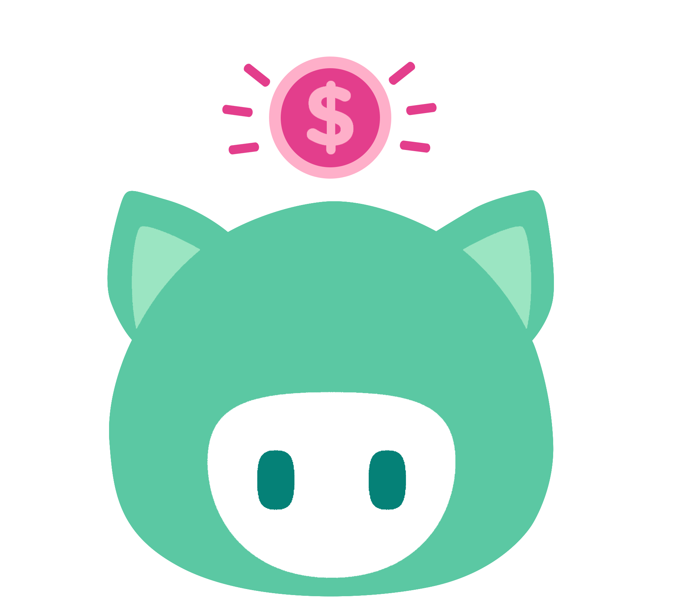
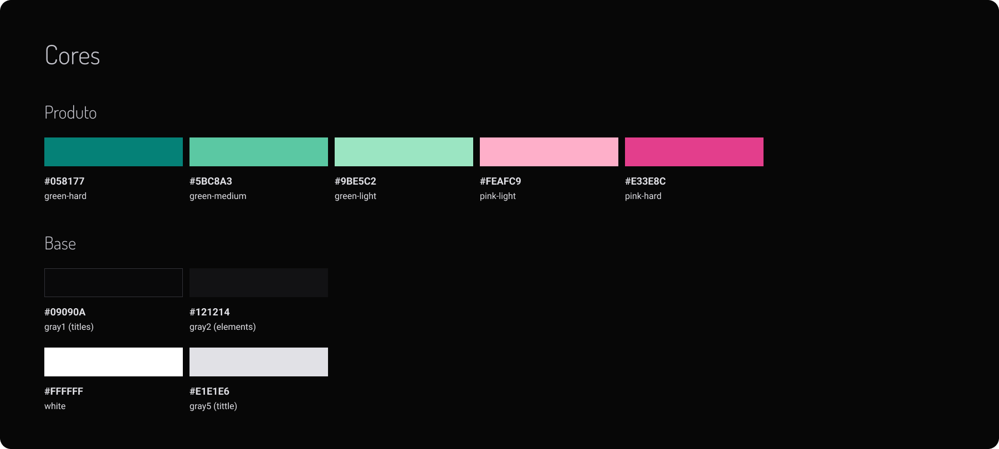
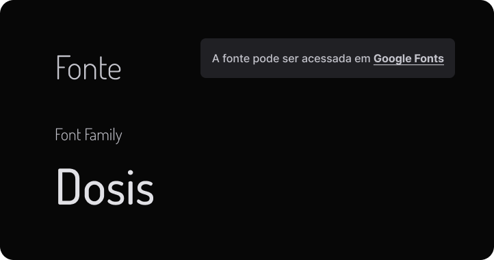
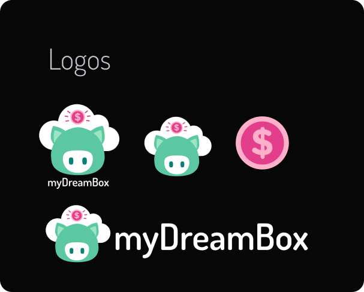
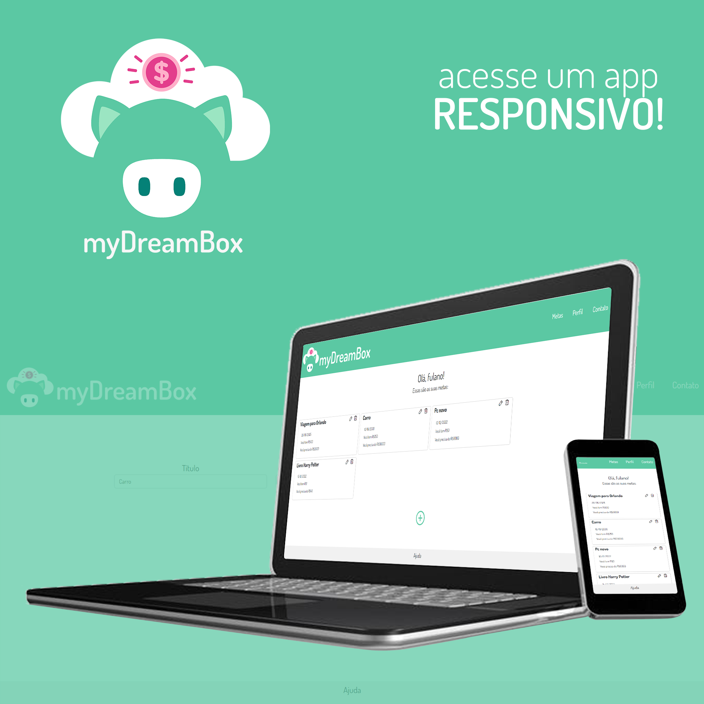

<h1 align="center">myDreamBox</h1>

## Sobre o myDreamBox

O myDreamBox é uma aplicação para auxiliar no controle de metas financeiras pessoais. Com essa aplicação você poderá:

- Criar metas, definindo título, valor total, data de desejada para realização e o valor reservado atualmente;
- Editar metas;
- Excluir metas.

## Prototipagem

Antes de seu desenvolvimento, o myDreamBox teve seu protótipo criado, algo que oriontou toda a sua implementação. A paleta de cores, fontes e ícones também foram pensados nessa etapa.
**[Veja o protótipo](https://www.figma.com/file/r0loiAVkuDAUsMN7AzslbF/myDreamBox?node-id=0%3A1)**

**Cores:** Todo o projeto tem em sua base apenas duas cores. O verde associado ao dinheiro e o rosa ao porquinho que simboliza o ato de guardar dinheiro.
  
**Fonte:** [Dosis](https://fonts.google.com/specimen/Dosis)

  
  

## Como utilizar?

A utilização é fácil, siga os passos abaixo:

<h3>O que você precisa ter?</h3>

- **[XAMPP](https://www.apachefriends.org/pt_br/index.html)**
- **[Composer](https://getcomposer.org/download/)**
- **[Laravel](https://laravel.com/)**
- **[VS Code](https://code.visualstudio.com/Download)**

<h3>Instalação</h3>

Para isso, será necessário que você clone esse projeto para a sua máquina. 

1º - Crie um diretório específico para a aplicação

2º - Abra-o no VS Code

3º - Execute no terminal do projeto: `git init`

4º - Execute no terminal do projeto: `git clone https://github.com/luizcampos/my-dream-box.git`

5º - O arquivo '.env' e a pasta 'vendor' não serão clonados. Baixe-os aqui: https://drive.google.com/drive/folders/1-40ZA3FJcqU8NTBfYHk66PYBj_4IySQd?usp=sharing. Após isso, inclua-os no seu projeto.

<h3>Conectando ao Banco de Dados</h3>

1º - Execute o XAMPP, dando start no <strong>Apache</strong> e no <strong>MySQL</strong>

2º - Acesse http://localhost/phpmyadmin/index.php

3º - Crie o Banco de Dados com nome "mydreambox"

4º - Verifique se arquivo '.env', que contém todas as variáveis ambiente, possui como valor da variável DB_DATABASE o nome "mydreambox"

5º - No terminal do projeto execute o comando: `php artisan migrate`

<h3>Executando a aplicação</h3>

Para executar, basta digitar no terminal do projeto aberto no VS Code o seguinte: `php artisan serve` e clicar no link local exibido.

## Tecnologias e ferramentas aplicadas

- **[Figma](https://www.figma.com/file/r0loiAVkuDAUsMN7AzslbF/myDreamBox?node-id=0%3A1)**
- Framework **[Laravel](https://laravel.com/)**
- HTML, CSS e JavaScript
- **[Bootstrap](https://getbootstrap.com.br/)**
- Biblioteca **[Phosphor Icons](https://phosphoricons.com/)**
- **[XAMPP](https://www.apachefriends.org/pt_br/index.html)** e phpmyadmin
- **[Git](https://git-scm.com/)** e **[GitHub](https://github.com/)**  
- Photoshop

## Autor e ajuda

O myDreamBox foi criado por Luiz Fellipe Campos. Você pode solicitar ajuda ou enviar uma mensagem através de um destes canais:

   
   
   
  

